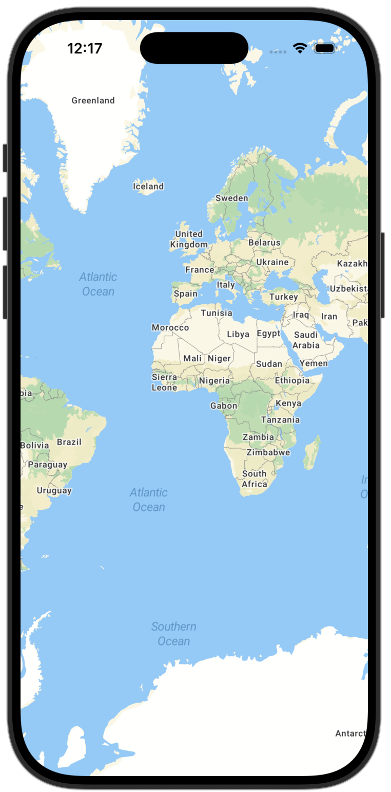
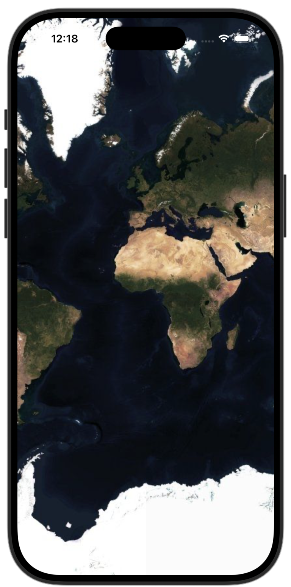

# MapTiler SDK Swift
<p align="center">

</p>

<div align="center">

[](https://swiftpackageindex.com/maptiler/maptiler-sdk-swift)
[](https://swiftpackageindex.com/maptiler/maptiler-sdk-swift)

</div>


The MapTiler SDK Swift is a native SDK written in Swift, designed to work with the well-established MapTiler Cloud service, which provides all the data required to fuel a complete mobile mapping experience: vector tiles, geojson, map interaction, custom styles, data visualization and more.

## Features
- [x] Map interaction
- [x] Pre-made map styles
- [x] VectorTile and GeoJSON sources
- [x] Fill, Line and Symbol layers
- [x] Custom Annotation Views
- [x] Location tracking
- [x] Globe and 3D Terrain
- [x] UIKit and SwiftUI support

## Basic Usage

Make sure to set your MapTiler Cloud API key first. (i.e. in AppDelegate):

```swift
Task {
    await MTConfig.shared.setAPIKey("YOUR_API_KEY")
}
```

### UIKit

```swift
import MapTilerSDK

let coordinates = CLLocationCoordinate2D(latitude: 47.137765, longitude: 8.581651)
let options = MTMapOptions(center: coordinates, zoom: 2.0, bearing: 1.0, pitch: 20.0)
var mapView = MTMapView(frame: view.frame, options: options, referenceStyle: .streets)
mapView.delegate = self

view.addSubview(mapView)
```

If you are using auto layout, you can call the helper function for anchors pinning. This ensures correct orientation updates.

```swift
mapView.pinToSuperviewEdges()
```

### SwiftUI

```swift
import MapTilerSDK

@State private var mapView = MTMapView(options: MTMapOptions(zoom: 2.0))

var body: some View {
    MTMapViewContainer(map: mapView) {}
        .referenceStyle(.streets)
}
```

For detailed functionality overview refer to the API Reference documentation or build local docs in Xcode: Product -> Build Documentation.

## Sources and Layers

Sources and layers can be added to the map view style object as soon as map is initialized. Setting the style after adding layers resets them to default, so make sure style is finished loading first.

### UIKit

```swift
guard let style = mapView.style else {
    return
}

if let contoursTilesURL = URL(string: "https://api.maptiler.com/tiles/contours-v2/tiles.json?key=YOUR_API_KEY") {
    let contoursDataSource = MTVectorTileSource(identifier: "contoursSource", url: contoursTilesURL)
    style.addSource(contoursDataSource)

    let contoursLayer = MTLineLayer(identifier: "contoursLayer", sourceIdentifier: contoursDataSource.identifier, sourceLayer: "contour_ft")
    contoursLayer.color = .brown
    contoursLayer.width = 2.0

    style.addLayer(contoursLayer)
}
```

### SwiftUI

```swift
@State private var mapView = MTMapView(options: MTMapOptions(zoom: 2.0))

var body: some View {
    MTMapViewContainer(map: mapView) {
        MTVectorTileSource(identifier: "countoursSource", url: URL(string: "https://api.maptiler.com/tiles/contours-v2/tiles.json?key=YOUR_API_KEY"))

        MTLineLayer(identifier: "contoursLayer", sourceIdentifier: "countoursSource", sourceLayer: "contour_ft")
            .color(.brown)
            .width(2.0)

    }
}
```

## Markers and Popups

Markers and popups (Text, Custom Annotation) can be used for highlighting points of interest on the map.

### UIKit
```swift
let coordinates = CLLocationCoordinate2D(latitude: 47.137765, longitude: 8.581651)

let popup = MTTextPopup(coordinates: coordinates, text: "MapTiler", offset: 20.0)
let marker = MTMarker(coordinates: coordinates, popup: popup)
marker.draggable = true

mapView.addMarker(marker)
```

### SwiftUI
```swift
@State private var mapView = MTMapView(options: MTMapOptions(zoom: 2.0))

let coordinates = CLLocationCoordinate2D(latitude: 47.137765, longitude: 8.581651)

var body: some View {
    MTMapViewContainer(map: mapView) {
        let popup = MTTextPopup(coordinates: coordinates, text: "MapTiler", offset: 20.0)

        MTMarker(coordinates: coordinates, draggable: true, popup: popup)
    }
}
```

Alternatively add content on custom actions:

```swift
@State private var mapView = MTMapView(options: MTMapOptions(zoom: 2.0))

let coordinates = CLLocationCoordinate2D(latitude: 47.137765, longitude: 8.581651)

var body: some View {
    MTMapViewContainer(map: mapView) {
    }
        .didInitialize {
            let marker = MTMarker(coordinates: coordinates)

            Task {
                await mapView.addMarker(marker)
            }
        }

    Button("Add Popup") {
        Task {
            let popup = MTTextPopup(coordinates: coordinates, text: "MapTiler", offset: 20.0)

            await mapView.addTextPopup(popup)
        }
    }
}
```

For additional examples refer to the Examples directory.

## Custom Annotations
In addition to `MTMarker` and `MTTextPopup`, you can use `MTCustomAnnotationView` class to make your own annotations and add them to the map. You can subclass to create custom UI it or use it as is for simple designs.

```swift
let customSize = CGSize(width: 200.0, height: 80.0)
let coordinates = CLLocationCoordinate2D(latitude: 47.137765, longitude: 8.581651)
let offset = MTPoint(x: 0, y: -80)

let myCustomView = MTCustomAnnotationView(size: customSize, coordinates: coordinates, offset: offset)
myCustomView.backgroundColor = .blue

myCustomView.addTo(mapView)
```


## Space
The space option customizes the globe’s background, simulating deep space or skybox effects.

- Prerequisite: use globe projection. Set `projection: .globe` in `MTMapOptions`.

Usage — solid color background

```swift
import MapTilerSDK

// UIKit
let options = MTMapOptions(
    projection: .globe,
    space: .config(
        MTSpace(
            color: MTColor(color: UIColor(hex: "#111122")!.cgColor)
        )
    )
)
let mapView = MTMapView(frame: view.bounds, options: options, referenceStyle: .streets)

// SwiftUI
@State private var mapView = MTMapView(
    options: MTMapOptions(
        projection: .globe,
        space: .config(MTSpace(color: MTColor(color: UIColor(hex: "#111122")!.cgColor)))
    )
)
```

Presets — predefined cubemaps

- `space`: Dark blue background; stars stay white. Space color changes background color.
- `stars` (default): Black background; space color changes stars color.
- `milkyway`: Black half‑transparent background with standard milky way and stars; space color tints stars and milky way.
- `milkyway-subtle`: Subtle milky way, fewer stars; space color tints stars and milky way.
- `milkyway-bright`: Bright milky way, more stars; space color tints stars and milky way.
- `milkyway-colored`: Full image with natural colors; space color has no effect.

```swift
// Use a preset
let options = MTMapOptions(
    projection: .globe,
    space: .config(MTSpace(preset: .space))
)
```

Custom cubemap — provide all faces

```swift
let faces = MTSpaceFaces(
    pX: URL(string: "https://example.com/space/px.png")!,
    nX: URL(string: "https://example.com/space/nx.png")!,
    pY: URL(string: "https://example.com/space/py.png")!,
    nY: URL(string: "https://example.com/space/ny.png")!,
    pZ: URL(string: "https://example.com/space/pz.png")!,
    nZ: URL(string: "https://example.com/space/nz.png")!
)

let options = MTMapOptions(
    projection: .globe,
    space: .config(MTSpace(faces: faces))
)
```

Cubemap by path — files named px, nx, py, ny, pz, nz with the given format

```swift
let path = MTSpacePath(
    baseUrl: URL(string: "https://example.com/spacebox/transparent")!,
    format: "png" // defaults to PNG if omitted
)

let options = MTMapOptions(
    projection: .globe,
    space: .config(MTSpace(path: path))
)
```

Dynamic updates — change space at runtime

```swift
mapView.didInitialize = {
    Task {
        await mapView.setSpace(
            .config(
                MTSpace(
                    color: MTColor(color: UIColor.red.cgColor),
                    path: MTSpacePath(baseUrl: URL(string: "https://example.com/spacebox/transparent")!)
                )
            )
        )
    }
}
```

Note: When calling `setSpace`, any field not explicitly provided (e.g., `color`, `faces`, `path`, or `preset`) keeps its previous value.


## Halo
The halo option adds a gradient-based atmospheric glow around the globe, simulating the visual effect of Earth's atmosphere when viewed from space.

- Prerequisite: use globe projection. Set `projection: .globe` in `MTMapOptions`.

Usage — enable simple halo

```swift
import MapTilerSDK

// UIKit
let options = MTMapOptions(
    projection: .globe,
    halo: .enabled(true)
)
let mapView = MTMapView(frame: view.bounds, options: options, referenceStyle: .outdoor)

// SwiftUI
@State private var mapView = MTMapView(
    options: MTMapOptions(
        projection: .globe,
        halo: .enabled(true)
    )
)
```

Custom gradient — scale and stops

```swift
let options = MTMapOptions(
    projection: .globe,
    halo: .config(
        MTHalo(
            scale: 1.5, // Controls the halo size
            stops: [
                MTHaloStop(position: 0.2, color: MTColor(hex: "#00000000")),
                MTHaloStop(position: 0.2, color: MTColor(hex: "#FF0000")),
                MTHaloStop(position: 0.4, color: MTColor(hex: "#FF0000")),
                MTHaloStop(position: 0.4, color: MTColor(hex: "#00000000")),
                MTHaloStop(position: 0.6, color: MTColor(hex: "#00000000")),
                MTHaloStop(position: 0.6, color: MTColor(hex: "#FF0000")),
                MTHaloStop(position: 0.8, color: MTColor(hex: "#FF0000")),
                MTHaloStop(position: 0.8, color: MTColor(hex: "#00000000")),
                MTHaloStop(position: 1.0, color: MTColor(hex: "#00000000"))
            ]
        )
    )
)
```

Dynamic updates — change halo at runtime

```swift
mapView.didInitialize = {
    Task {
        await mapView.setHalo(
            .config(
                MTHalo(
                    scale: 2.0,
                    stops: [
                        MTHaloStop(position: 0.0, color: MTColor(hex: "#87CEFA")),
                        MTHaloStop(position: 0.5, color: MTColor(hex: "#0000FABF")),
                        MTHaloStop(position: 0.75, color: MTColor(hex: "#FF000000"))
                    ]
                )
            )
        )
    }
}
```

Disable animations — halo and space

```swift
mapView.didInitialize = {
    Task {
        await mapView.disableHaloAnimations()
        await mapView.disableSpaceAnimations()
    }
}
```

### Developer Docs
For more information and API Reference visit: https://docs.maptiler.com/mobile-sdk/ios/ or browse ready-to-use code examples at the [Examples](https://github.com/maptiler/maptiler-sdk-swift/tree/main/Examples) directory in this repo.

# Installation
MapTiler Swift SDK is a Swift Package and can be added as dependency through **Swift Package Manager**.

- File -> Add Package Dependencies
- Add https://github.com/maptiler/maptiler-sdk-swift.git

<p align="center">


</p>

# License
MapTiler SDK Swift is released under the BSD 3-Clause license. See LICENSE for details.
