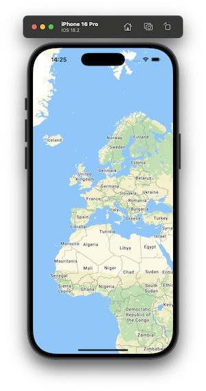
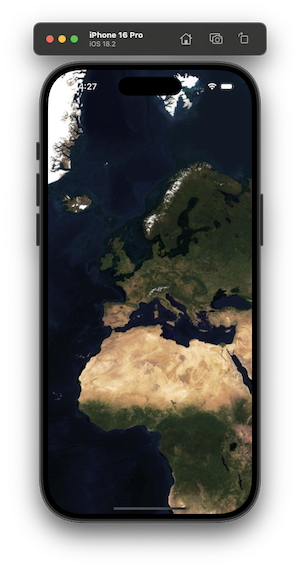

# MapTiler SDK Swift
<p align="center">

</p>
<p align="center">


</p>

The MapTiler SDK Swift is a native SDK written in Swift, designed to work with the well-established MapTiler Cloud service, which provides all the data required to fuel a complete mobile mapping experience: vector tiles, geojson, map interaction, custom styles, data visualization and more.

## Features
- [x] Map interaction
- [x] Pre-made map styles
- [x] VectorTile and GeoJSON sources
- [x] Fill, Line and Symbol layers
- [x] Custom Annotation Views
- [x] Location tracking
- [x] Globe and 3D Terrain
- [x] UIKit and SwiftUI support

## Basic Usage

Make sure to set your MapTiler Cloud API key first. (i.e. in AppDelegate):

```swift
MTConfig.shared.setAPIKey("YOUR_API_KEY")
```

### UIKit

```swift
import MapTilerSDK

let coordinates = CLLocationCoordinate2D(latitude: 47.137765, longitude: 8.581651)
let options = MTMapOptions(center: coordinates, zoom: 2.0, bearing: 1.0, pitch: 20.0)
var mapView = MTMapView(frame: view.frame, options: options, referenceStyle: .streets)
mapView.delegate = self

view.addSubview(mapView)
```

If you are using auto layout, you can call the helper function for anchors pinning. This ensures correct orientation updates.

```swift
mapView.pinToSuperviewEdges()
```

### SwiftUI

```swift
import MapTilerSDK

@State private var referenceStyle: MTMapReferenceStyle = .streets
@State private var styleVariant: MTMapStyleVariant? = .defaultVariant

@State private var mapView = MTMapView(options: MTMapOptions(zoom: 2.0))

var body: some View {
    MTMapViewContainer(map: mapView) {}
        .referenceStyle(referenceStyle)
        .styleVariant(styleVariant)
}
```

For detailed functionality overview refer to the API Reference documentation or build local docs in Xcode: Product -> Build Documentation.

## Sources and Layers

Sources and layers can be added to the map view style object as soon as map is initialized.

### UIKit

```swift
guard let style = mapView.style else {
    return
}

if let contoursTilesURL = URL(string: "https://api.maptiler.com/tiles/contours-v2/{z}/{x}/{y}.pbf?key=YOUR_API_KEY") {
    let contoursDataSource = MTVectorTileSource(identifier: "contoursSource", tiles: [contoursTilesURL])
    style.addSource(contoursDataSource)

    let contoursLayer = MTLineLayer(identifier: "contoursLayer", sourceIdentifier: contoursDataSource.identifier, sourceLayer: "contour_ft")
    contoursLayer.color = .brown
    contoursLayer.width = 2.0

    style.addLayer(contoursLayer)
}
```

### SwiftUI

```swift
@State private var mapView = MTMapView(options: MTMapOptions(zoom: 2.0))

var body: some View {
    MTMapViewContainer(map: mapView) {
        MTVectorTileSource(identifier: "countoursSource", tiles: [URL(string: "https://api.maptiler.com/tiles/contours-v2/{z}/{x}/{y}.pbf?key=YOUR_API_KEY")])

        MTLineLayer(identifier: "contoursLayer", sourceIdentifier: "countoursSource", sourceLayer: "contour_ft")
            .color(.brown)
            .width(2.0)

    }
}
```

## Markers and Popups

Markers and popups (Text, Custom Annotation) can be used for highlighting points of interest on the map.

### UIKit
```swift
let coordinates = CLLocationCoordinate2D(latitude: 47.137765, longitude: 8.581651)

let popup = MTTextPopup(coordinates: coordinates, text: "MapTiler", offset: 20.0)
let marker = MTMarker(coordinates: coordinates, popup: popup)
marker.draggable = true

mapView.addMarker(marker)
```

### SwiftUI
```swift
@State private var mapView = MTMapView(options: MTMapOptions(zoom: 2.0))

let coordinates = CLLocationCoordinate2D(latitude: 47.137765, longitude: 8.581651)

var body: some View {
    MTMapViewContainer(map: mapView) {
        let popup = MTTextPopup(coordinates: coordinates, text: "MapTiler", offset: 20.0)

        MTMarker(coordinates: coordinates, draggable: true, popup: popup)
    }
}
```

Alternatively add content on custom actions:

```swift
@State private var mapView = MTMapView(options: MTMapOptions(zoom: 2.0))

let coordinates = CLLocationCoordinate2D(latitude: 47.137765, longitude: 8.581651)

var body: some View {
    MTMapViewContainer(map: mapView) {
    }
        .didInitialize {
            let marker = MTMarker(coordinates: coordinates)

            Task {
                await mapView.addMarker(marker)
            }
        }

    Button("Add Popup") {
        Task {
            let popup = MTTextPopup(coordinates: coordinates, text: "MapTiler", offset: 20.0)

            await mapView.addTextPopup(popup)
        }
    }
}
```

For additional examples refer to the Examples directory.

## Custom Annotations
In addition to `MTMarker` and `MTTextPopup`, you can use `MTCustomAnnotationView` class to make your own annotations and add them to the map. You can subclass to create custom UI it or use it as is for simple designs.

```swift
let customSize = CGSize(width: 200.0, height: 80.0)
let coordinates = CLLocationCoordinate2D(latitude: 47.137765, longitude: 8.581651)

let myCustomView = MTCustomAnnotationView(size: customSize, coordinates: coordinates)
myCustomView.backgroundColor = .blue

myCustomView.addTo(mapView)
```


# Installation
MapTiler Swift SDK is a Swift Package and can be added as dependency through **Swift Package Manager**.

- File -> Add Package Dependencies
- Add https://github.com/maptiler/maptiler-sdk-swift.git

<p align="center">


</p>

# License
MapTiler SDK Swift is released under the BSD 3-Clause license. See LICENSE for details.